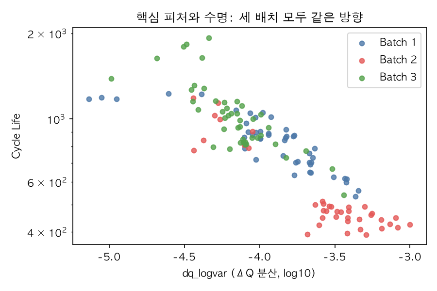
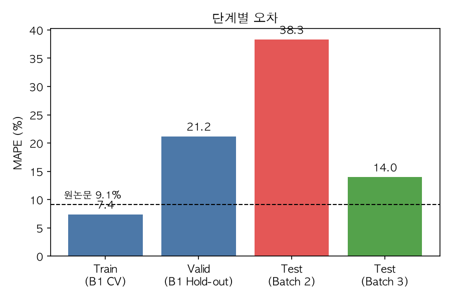
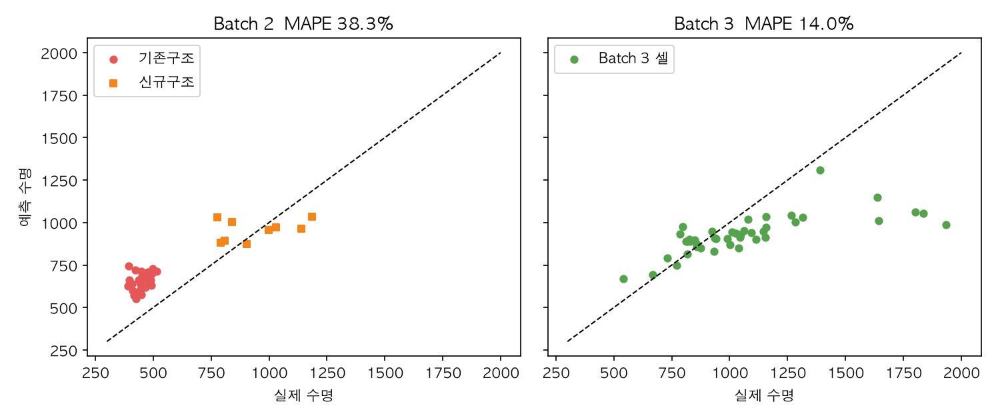

# ESS 배터리 수명 예측

초기 100 사이클의 충·방전 데이터만으로 배터리 수명(Cycle Life)을 예측해, ESS 배터리의 교체 시점을 사전에 계획할 수 있는지 확인한다.


## 프로젝트 개요
- 데이터셋 : MIT-Stanford Battery Dataset (Severson et al., Nature Energy 2019)
- 학습 데이터 : Batch 1 (2017-05-12)
- 평가 데이터 : Batch 2 (2018-02-20) / 추가 검증 : Batch 3 (2018-04-12)
- 태스크 : Regression (Cycle Life 예측, 타깃 `log10(cycle_life)`)


## 파일 구조
```
├── data/
│   └── README.md          # 데이터 받는 법 (원본 .mat 은 저장소에 미포함)
├── notebooks/
│   ├── 01_EDA.ipynb
│   ├── 02_feature_engineering.ipynb
│   └── 03_modeling.ipynb
├── src/
│   ├── preprocess.py
│   ├── features.py
│   ├── train.py
│   ├── models.py
│   └── make_figures.py    # README 그림 생성
├── results/
│   ├── model_performance.csv
│   ├── experiment_log.md
│   ├── experiments.csv
│   ├── ensemble_experiments.csv
│   ├── features.csv
│   └── figures/
├── requirements.txt
└── README.md
```


## 환경 설정
```bash
git clone https://github.com/jaewon-cmd/ess-battery-project.git
cd ess-battery-project
pip install -r requirements.txt   # Python 3.11 에서 검증
# 데이터는 data/README.md 를 보고 data/ 폴더에 넣는다
```


## EDA

용어 : **ρ**는 상관계수다. −1에 가까울수록 "값이 클수록 수명이 짧다"는 뜻이고, 0이면 관계가 없다.

| 질문 | 핵심 발견 | 모델링 시사점 |
|---|---|---|
| Cycle Life 분포 | 분포의 봉우리가 곧 배치. 짧은 셀은 전부 Batch 2 기존구조 | 타깃 `log10`, 배치를 고려한 분할 |
| 열화 곡선 | 수명의 75~79% 지점에서 꺾이고 후반에 가속. 초기 용량으로는 구분 어려움 | 용량 대신 ΔQ(V)를 입력으로 |
| ΔQ(V) 곡선 | 단수명 셀이 2.0~2.7배 깊게 파임, 분산과 수명의 ρ −0.89 | `dq_logvar`를 핵심 피처로 |
| 충전 속도 | Batch 1에서만 고속 충전 = 단수명 (ρ −0.63) | 충전 피처는 후보로만 |
| 상관·공선성 | ΔQ 피처 3개는 서로 ρ≈0.97 | 대표 1개만 쓰고 규제 모델 |

#### 1. Cycle Life 분포
- 수명은 392~1,935 사이클이다. 장수명(>1,000)은 27.9%, 단수명(<500)은 21.7%이다.
- 핵심 발견 : 짧은 셀은 전부 Batch 2의 기존구조 셀이다. 같은 프로토콜의 신규구조 셀은 수명이 약 2배(중앙값 451 vs 904)라서, 충전 조건이 아니라 셀 구조 차이로 보인다.

| | 셀 수 | 수명 범위 | 중앙값 | 장수명 (>1,000) | 단수명 (<500) |
|---|---|---|---|---|---|
| Batch 1 | 46 | 534–1,227 | 859 | 21.7% | 0% |
| Batch 2 | 39 | 392–1,186 | 472 | 7.7% | **71.8%** |
| Batch 3 | 44 | 541–1,935 | 1,006 | **52.3%** | 0% |
| 전체 | 129 | 392–1,935 | 828 | 27.9% | 21.7% |

#### 2. 열화 곡선 분석
- 용량은 수명의 75~79% 지점에서 꺾이고(knee), 그 뒤 빠르게 줄어든다. (Batch 1 601 / Batch 2 344 / Batch 3 815 사이클)
- 평균 열화 속도는 단수명 0.48, 장수명 0.16 mAh/cycle로 약 3배 차이다.
- 핵심 발견 : 초기 용량 변화와 수명의 상관은 약하다 (ρ = −0.15). 용량 추이만으로는 수명을 예측하기 어렵다.

| | knee 사이클 | 수명 대비 | 열화 속도 0~20% | 40~60% | 80~100% |
|---|---|---|---|---|---|
| Batch 1 | 601 | 75% | 0.03 | 0.09 | 0.75 |
| Batch 2 | 344 | 75% | −0.01 | 0.19 | 1.48 |
| Batch 3 | 815 | 79% | 0.04 | 0.08 | 0.63 |

(열화 속도 단위 : mAh/cycle, 수명을 100%로 본 구간별 평균)

#### 3. ΔQ(V) 곡선 분석
- ΔQ(V)는 사이클 100과 사이클 10의 방전 곡선 차이다.
- 단수명 셀의 ΔQ 곡선이 세 배치 모두에서 2.0~2.7배 더 깊게 파인다.
- 핵심 발견 : ΔQ의 분산(`dq_logvar`)이 수명과 가장 강하게 연관된다 (통합 ρ = −0.89, 배치별 −0.72~−0.85). 다만 배치마다 값의 중심은 다르다.

| | 단수명 평균 곡선 최저점 | 장수명 평균 곡선 최저점 | 배수 | `dq_logvar`–수명 ρ | `dq_logvar` 평균 |
|---|---|---|---|---|---|
| Batch 1 | −0.050 Ah | −0.024 Ah | 2.1배 | −0.85 | −3.92 |
| Batch 2 | −0.066 Ah | −0.024 Ah | 2.7배 | −0.72 | −3.59 |
| Batch 3 | −0.033 Ah | −0.017 Ah | 2.0배 | −0.80 | −4.18 |
| 통합 | | | | **−0.89** | |



#### 4. 충전 속도(C-rate)와 수명의 관계
- Batch 1에서만 "고속 충전 = 단수명"이 보인다 (ρ = −0.63). 평균 C-rate <4.2C는 수명 995, >5.0C는 546 사이클.
- Batch 2·3은 평균 C-rate가 약 4.8C로 거의 같아서 비교할 수 없다. 합치면 관계가 사라진다 (ρ = −0.15).
- 핵심 발견 : 충전 피처는 핵심이 아닌 후보로만 쓴다.

| | 평균 C-rate 범위 | 평균 C-rate–수명 ρ | p |
|---|---|---|---|
| Batch 1 | 3.6~5.4C | **−0.63** | 2.6e-06 |
| Batch 2 | 4.79~4.81C | +0.28 | 0.087 |
| Batch 3 | 4.79~4.81C | −0.13 | 0.39 |
| 통합 | | −0.15 | 0.083 |

(Batch 1의 평균 C-rate 구간별 평균 수명 : <4.2C 995 → 4.2~4.6C 859 → 4.6~5.0C 731 → >5.0C 546 사이클)

#### 5. 추가 확인한 내용
- 상관은 통합과 배치별 부호를 함께 봤다. 부호가 배치마다 다른 피처(`QD_mean`, `chargetime`)는 제외했다.
- ΔQ 피처 3개는 서로 ρ≈0.97(VIF 10 초과)이라 `dq_logvar` 하나만 쓴다. 이때 `dq_logvar`의 VIF는 1.2~1.3(전체 피처 최대 1.9)이다.

| 피처 (vs log10 수명) | 통합 | Batch 1 | Batch 2 | Batch 3 | 판단 |
|---|---|---|---|---|---|
| `dq_logvar` | **−0.89** | −0.85 | −0.72 | −0.80 | 신뢰 가능 |
| `dq_logmean` | −0.87 | −0.83 | −0.72 | −0.76 | 신뢰 가능 (`dq_logvar`와 중복) |
| `QD_mean` | −0.51 | +0.20 | +0.12 | +0.16 | 통합과 배치 내 부호 반대 |
| `chargetime` | −0.03 | +0.64 | −0.81 | +0.26 | 배치 간 부호 반전 |
| `avgC` | −0.15 | −0.63 | +0.28 | −0.13 | 배치 간 부호 불일치 |


## Modeling

### 피처 엔지니어링 전략
- 핵심 피처 : `dq_logvar` (ΔQ(V)의 분산, log10)
	- 세 배치 모두 수명과 같은 방향이었다 (ρ −0.72~−0.85).
	- 같은 셀 안의 차이라서, 배치마다 다른 `Qdlin` 시작점이 상쇄된다.
- 써 보고 채택하지 않은 피처 : 전압 구간별 ΔQ 분산, `QD_slope`·`IR`·`Tavg`, `C1`·`switch`
	- Batch 1 CV에서 1%p 이상 좋아지지 않았다 (`results/experiment_log.md`).
- 제외한 피처 : `dq_logmean`·`dq_logmin`(중복), `dq_skew`·`dq_kurt`, `Tmax`, `chargetime`, `QD_mean`, `avgC`·`C2`, `newstructure` (근거는 EDA)
- 전처리 : 결측 대치(`IR`)와 스케일링은 학습 데이터로만 fit하는 Pipeline 안에서 하고, 타깃은 `log10`으로 학습한다.

### 모델 선택 및 근거
- 후보 모델 : Elastic Net, Ridge, PLS, Random Forest, Gradient Boosting, XGBoost, LightGBM, Gaussian Process (기준선 : 평균 예측)
	- XGBoost·LightGBM은 OpenMP가 필요하다 (macOS : `brew install libomp`). 설치가 늦어 처음 비교에서는 빠졌고, 나중에 같은 기준으로 다시 비교했다. 선택 결과는 같았다.
	- 모델 예측을 평균하는 앙상블 4종도 비교했다. Train CV가 7.83~9.21%로 단일 선형 모델(7.40%)보다 높아 채택하지 않았다.
- 최종 모델 : `dq_logvar` + Elastic Net (`alpha=0.01`, `l1_ratio=0.5`)
- 선택 이유
	- Batch 1 Train CV MAPE가 선형 모델 7.2~7.4%로 가장 낮다. (평균 예측 19.2%, 트리·부스팅·GP 9.2~11.5%)
	- 어떤 추가 피처도 1%p 이상 좋아지지 않아서, 가장 단순한 조합을 택했다.
	- 선택에는 Batch 1의 CV만 썼고 Batch 2는 쓰지 않았다.
	- Hold-out(11셀)은 극단 셀 3개 때문에 모델별로 크게 갈렸고(선형 약 21~24%, 트리·부스팅·GP 약 7~11%), 표본이 작아 참고만 했다.

**전략 → 구현 반영**

| 사전 전략 (Day 1) | 구현 | 위치 |
|---|---|---|
| ΔQ(V) 분산을 핵심 피처로 | `dq_logvar` 계산, 유일한 최종 입력 | `src/features.py` |
| 같은 프로토콜 셀이 학습·검증에 섞이지 않게 분할 | GroupShuffleSplit(Hold-out), GroupKFold(CV) | `src/train.py` |
| 누수 방지 | 대치·스케일링을 Pipeline 안에서 학습 데이터로만 fit | `src/train.py` |
| 공선성·과적합 대응 | 대표 피처 1개 + 규제 모델(Elastic Net) | `src/train.py` |
| Batch 2는 마지막에 한 번만 평가 | 평가 전 선택을 기록하고 Test 1회 실행 | `results/experiment_log.md` |
| 후보 모델 비교 | 8개 모델 + 앙상블, 같은 분할·지표 | `src/models.py` |

(전체 대응은 `notebooks/03_modeling.ipynb` 9번 섹션)


## 성능 결과

| 구분 | MAPE (%) | 비고 |
| --- | --- | --- |
| Train (Batch 1 CV) | 7.40 | 프로토콜 단위 5-fold 평균 |
| Valid (Batch 1 Hold-out) | 21.20 | 프로토콜 단위 Hold-out 11셀. 극단 셀 3개를 빼면 10.60 |
| Test (Batch 2) | 38.32 | 평균 예측 67.09. 평균 편향 +36.2% (39셀 중 34셀 과대예측) |
| Gap (Train-Valid) | +13.80 | (+) : 과적합 의심 |
| Gap (Valid-Test) | +17.12 | (+) : 배치간 일반화 저하 의심 |
| Gap (Target-Test) | +29.22 | Target : 원논문 9.1% |
| Test (Batch 3) | 13.98 | 추가 검증. 평균 예측 21.15. 평균 편향 −8.0% |
| Gap (Batch2-Batch3) | −24.34 | Batch 3 − Batch 2. (−) : Batch 3의 오차가 더 작음 |
| Gap (Target-Test) [Batch 3] | +4.88 | Batch 3 기준 |



- 읽는 법
	- **MAPE**는 평균 오차율(%)이다. 낮을수록 좋다. 원논문 성능은 Regression 9.1%이다.
	- **Gap**은 오차가 커질수록 (+)이다. (+)가 크면 나쁘다.
	- 최종 모델은 `dq_logvar` + Elastic Net이다. Test는 Batch 1 전체(46셀)로 학습해 한 번만 평가했다.
- 데이터 분할과 파이프라인
	- Batch 1(46셀)을 프로토콜 단위로 학습 35셀 / Hold-out 11셀로 나눴다 (겹침 0).
	- 결측 대치, 스케일링, `log10` 변환은 Pipeline 안에서 학습 데이터로만 fit한다.
	- Batch 2는 최종 모델을 확정한 뒤(`results/experiment_log.md`에 평가 전 기록) 한 번만 평가했다.
	- 상세는 `notebooks/03_modeling.ipynb` 0·1번 섹션.
- **Train (Batch 1 CV)** : 학습 셀 안에서 프로토콜 단위로 묶어 나눈 5-fold(GroupKFold) 교차검증의 평균 성능.
- **Valid (Batch 1 Hold-out)** : 프로토콜 단위로 따로 떼어 둔 Batch 1의 11셀로 평가한 성능.
- **Valid를 CV가 아닌 Hold-out으로 쓴 이유**
	- 배터리 데이터는 셀 단위로 독립적이고, 셀마다 서로 다른 충전 프로토콜(C-rate)로 실험된다.
	- CV를 그대로 쓰면 같은 프로토콜의 셀이 학습과 검증에 나뉘어 데이터 누수(leakage) 위험이 남는다.
	- Hold-out은 프로토콜 단위 분리를 확실히 보장하고, 배치 간 일반화를 보는 이번 구조에도 더 적합하다.
	- (Train의 CV는 같은 프로토콜을 한 폴드에 묶는 GroupKFold라 누수가 없다.)
- **원논문 대비 (Gap Target-Test, Batch 2 기준)**
	- 원논문 9.1%에 비해 Batch 2 Test는 38.32%로, 오차가 **29.22%p(약 4.2배)** 크다.
	- 식으로는 Target − Test = −29.22%p다. 표는 다른 Gap과 맞추려고 Test − Target = +29.22로 적었다.
	- Classification 기준(원논문 1-Accuracy 4.9%)은 회귀를 택해서 해당하지 않는다.
- **Train → Valid (+13.80)**
	- 과적합처럼 보이지만, Hold-out 11셀 중 3셀(b1c0·1·2, 수명 약 1,180)이 원인이다.
	- 이 셀들은 ΔQ 분산이 학습 범위 밖이고, 수명 라벨도 검증되지 않은 셀이다.
	- 라벨이 불확실한 8셀을 빼면 Train 8.15 / Valid 10.60으로 Gap이 +2.45로 줄어든다.
	- Valid는 표본이 작아 판단 근거로는 약하다.
- **Valid → Test (+17.12)**
	- Batch 2에서 오차가 크게 늘었다. 평균 예측(67.09%)보다는 크게 낫다.
	- 배치가 바뀌면 일반화가 크게 떨어진다.
- **Target → Test (+29.22)**
	- 원논문 9.1%에 크게 못 미친다.
	- 이 데이터에서는 Batch 1과 Batch 2의 수명 분포가 크게 다르다 (Batch 2 셀의 77%가 Batch 1 수명 범위 밖).
	- Batch 2 안에서도 신규구조 셀 9개는 12.8%로 목표에 가깝다.
- **Batch 3이 Batch 2보다 낫다 (13.98 vs 38.32)**
	- Batch 3은 수명이 더 길고 분포도 다른데 오차는 더 작다.
	- 배치 간 수명 분포 차이보다 "같은 ΔQ 분산에서 수명이 얼마나 짧아지는가"가 성능을 좌우한다.



- **Gap (Batch2-Batch3) −24.34와 피처의 배치 과적합 가능성**
	- 과적합이 아니라는 근거 : 같은 모델이 Batch 3(13.98%)과 Batch 2의 신규구조 셀(12.8%)에서는 비슷하게 맞는다.
	- 일반화되지 않는 근거 : Batch 2 기존구조 셀 30개에서만 +46% 과대예측한다. 학습 범위 안의 셀도 50.3% 틀린다.
	- 해석 : 피처가 Batch 1에 과적합되었다기보다, Batch 1에 없던 셀 집단(기존구조)에서는 피처와 수명의 관계가 달라 일반화되지 않는 것으로 본다.
	- 특정 배치에 맞춘 피처의 과적합은 사후 시도에서 확인했다. 충전 피처(`C1`, `switch`)를 넣으면 Batch 1 검증은 좋아졌지만 Batch 2 43.92%, Batch 3 16.24%로 나빠졌다.
- **사후 개선 (Test 평가 이후의 시도, 독립 검증 아님)**
	- 라벨이 불확실한 8셀을 학습에서 정리하고 Ridge로 학습하면 Batch 2 29.16% / Batch 3 12.18%(Gap Target-Test +20.06)로 낮아진다. 개선의 대부분은 라벨 정리 효과다.
	- 반대로 Batch 1 안에서 배치 이동을 흉내 낸 검증으로 고른 모델(핵심 + 충전 피처 + Ridge)은 Batch 2 43.92% / Batch 3 16.24%로 오히려 나빠졌다.
	- 한 배치 안의 검증으로는 배치 간 일반화를 고르기 어렵다는 뜻이다.
	- 공식 결과는 38.32%로 그대로 두고, 사후 시도는 `results/experiment_log.md` 5·6번에 기록했다.


## 오류 분석

### 모델이 가장 크게 틀린 셀의 공통점
- Batch 2에서 가장 크게 틀린 8셀은 모두 **기존구조 셀**이다 (수명 392~452). 전부 실제보다 길게 예측했다 (+52~+89%).
- 오차의 대부분은 셀 집단에서 나온다.

| 셀 집단 | 셀 수 | MAPE | 예측 방향 |
|---|---|---|---|
| Batch 2 기존구조 | 30 | **46.0%** | 전부 과대예측 |
| Batch 2 신규구조 | 9 | 12.8% | 편향 +3.7% |
| Batch 3 학습 최대 수명(1,227) 초과 | 9 | 29.8% | 전부 과소예측 |
| Batch 3 범위 안 | 35 | 9.9% | |

### 원인 가설
- **가설 1. 외삽** : 학습 범위 밖이라서 틀렸다.
	- 기각. 범위 **안**의 기존구조 셀 18개도 50.3% 틀린다.
- **가설 2. 관계의 이동** : 같은 ΔQ 분산인데 기존구조 셀의 수명이 더 짧다.
	- Batch 1에서 분산이 가장 큰 셀들의 수명은 534~617, 비슷한 분산의 Batch 2 기존구조 셀은 중앙값 451이다.
	- 셀 구조나 제작 조건의 차이로 보이지만, 이 데이터만으로 확정할 수는 없다.
- **학습 라벨의 영향**
	- 라벨이 불확실한 8셀을 학습에서 빼면 Batch 2 MAPE가 38.32 → 30.31로 낮아진다.

### 참고 비교 (결과를 본 뒤 추가, 최종 모델은 바꾸지 않음)

| 모델 | Batch 2 MAPE (%) |
|---|---|
| Gaussian Process | 28.87 |
| LightGBM | 32.21 |
| Random Forest | 33.48 |
| Gradient Boosting | 33.50 |
| XGBoost | 35.00 |
| 앙상블 (평균) | 33.07~33.92 |
| **최종 모델 (Elastic Net)** | **38.32** |

- 평가 전에 정해 둔 비교군은 Gaussian Process, Gradient Boosting, Random Forest이다. XGBoost·LightGBM과 앙상블은 평가 뒤에 추가했다.
- Batch 3에서는 단일 모델이 12.58~15.48, 앙상블이 12.14~13.79로 최종 모델(13.98)과 비슷하다.
- Batch 1 CV에서 앞섰던 선형 모델의 순위가 Batch 2에서 뒤집혔다. Batch 1 안의 CV가 배치 이동을 반영하지 못한다는 뜻이다.

### 개선 방향
1. 구조·배치 차이를 설명하는 정보를 입력에 넣거나, 구조별로 관계를 따로 둔다.
2. 장수명·단수명 끝에서 포화되는 관계를 다룰 수 있는 비선형 모델이나 변환을 검토한다.
3. 라벨이 불확실한 셀의 처리 규칙을 학습 전에 정한다.
4. 배치 단위 교차검증으로 모델을 고른다.


## ESS 도메인 해석
- 이 모델을 실제 BESS에 적용한다면 어떤 의사결정에 활용 가능한가?
	- **셀·모듈 조기 선별** : 초기 100 사이클의 ΔQ(V) 분산으로 수명이 짧을 위험이 큰 셀을 가려내고, 교체 계획과 보증 기준을 정하는 데 쓸 수 있다.
	- 수치 자체보다 셀 간 순위와 구간이 더 믿을 만하다 (CV 7.4%, Batch 2 신규구조 12.8%, Batch 3 13.98%).
	- **예측이 틀리는 방향이 중요하다** : Batch 2 기존구조 셀은 실제보다 오래 갈 것으로 +46% 과대예측했다. 교체가 늦어져 예기치 못한 중단과 피크 대응 실패로 이어질 수 있는 위험한 방향이다.
	- 그래서 실제로 쓴다면 예측값을 그대로 쓰지 않고, 보수적으로 낮춘 하한이나 예측 구간을 써야 한다.
- 어떤 한계가 있으며, 실 배포를 위해 추가로 필요한 것은 무엇인가?
	- 한계
		- 실험실에서 정해진 프로토콜로 충·방전한 46셀(Batch 1)로 학습했고, 제작 조건이 다른 셀(Batch 2 기존구조)에는 일반화되지 않았다.
		- ΔQ(V)는 사이클 10과 100의 방전 곡선 전체가 필요하다. 실제 BESS는 부분 충·방전이 많아 같은 곡선을 얻기 어려울 수 있다.
	- 개발상 한계
		- ① 배치 간 일반화 : 기존구조 셀 +46% 과대예측
		- ② 표본 크기 : 46셀, Hold-out 11셀
		- ③ Batch 1 내부 CV·Hold-out이 배치 이동을 반영하지 못함
		- ④ 라벨 불확실 8셀 : 제외 시 Batch 2 38.32 → 30.31
		- ⑤ 피처 선별 EDA에서 Batch 2·3을 함께 봄 : 모델 선택은 Batch 1 CV만 썼지만 완전한 블라인드는 아님
		- ⑥ 미구현 : Leave-One-Batch-Out, 예측 구간(부트스트랩)
		- ⑦ 배치 이동을 흉내 낸 Batch 1 검증도 실제 배치 이동을 반영하지 못함 : 검증은 개선됐지만 Test는 악화
	- 실 배포를 위해 필요한 것
		- 실제 운영 데이터로 성능을 검증하는 Live Test
		- 제조 로트·구조 정보 같은 메타데이터와 배치 단위 검증
		- 예측 구간 제공
		- Model Drift와 Data Drift(입력 분포 변화)를 정기적으로 점검하고, 성능이 기준 이하로 떨어지면 재학습하는 규칙
		- 부분 방전에서도 계산할 수 있는 피처로의 확장


## 참고문헌
- Severson et al. (2019). Data-driven prediction of battery cycle life before capacity degradation. *Nature Energy*, 4, 383–391.


## 팀 구성
- 성재원 : EDA, 피처 엔지니어링, 모델 개발, 성능 평가(Batch 2, Batch 3)
